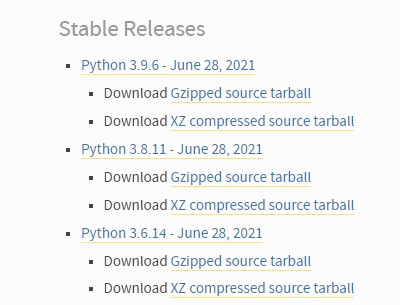
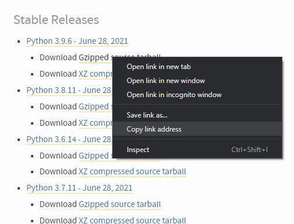
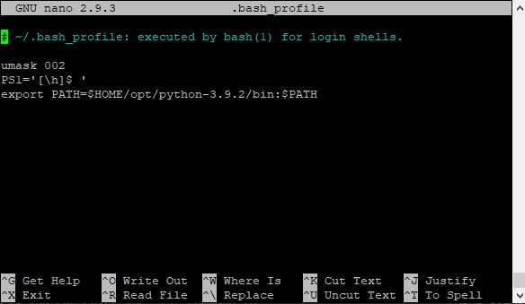

# DreamHost Guide: Installing Custom Version of Python 3

DreamHost users have the ability to install custom versions of Python 3 on DreamHost's Shared, VPS, and Dedicated servers. This guide expands upon the article found on the [DreamHost Knowledge Base](https://help.DreamHost.com/hc/en-us/articles/115000702772-Installing-a-custom-version-of-Python-3) for installing a custom version of Python 3 to provide a more complete breakdown of the process.

*NOTE: Python verson 3.9.2 was used for the demonstration of this process. Anywhere you see 3.9.2 should be replace with the version number you are attempting to download and install*

## Installing Python 3

1. Go to the official [Python Source Releases](https://www.python.org/downloads/source/) page and determine the version of Python you wish to install



2. Right click on the "Gzipped source tarball" link for the selected version and copy the link address. *(NOTE: This process my differ slightly from the screenshot depending on your operating and/or browser)* 

 

3. Login to your DreamHost server via SSH and run the following commands to make a temporary directory to download the Gzipped source tarball to and install from. 
```sh
[your_server_name]$ cd ~
[your_server_name]$ mkdir tmp 
```

4. Change directories into the new temporary directory that you just created.
```sh
[your_server_name]$ cd tmp
```

5. Enter the command `wget` followed by the link address that you copied in step 2 to download the desired version of Python. *(NOTE: The url below is for example purposes only. Be sure to use the url for the version of Python you wish to install)*
```sh
[your_server_name]$ wget https://www.python.org/ftp/python/3.9.6/Python-3.9.6.tgz
```

6. Unzip and extract the downloaded files. *(NOTE: The file to unzip should match the last segment of the url. i.e.- Python-x.x.x.tgz)*
```sh
[your_server_name]$ tar -zxvf Python-3.9.2.tgz
```

7. Change directories into the new unzipped Python version folder. *(NOTE: The directory name should match the last segment of the url minus the ".tgz". Alternatively you can enter the* `ls` *command to indentify the directory name)*
```sh
[your_server_name]$ cd Python-3.9.2
```

8. Configure the download for installation. *(NOTE: Make sure the version number entered matches the vesion you are attempting to install)*
```sh
[your_server_name]$ ./configure --prefix=$HOME/opt/python-3.9.2
```

9. Run the following command to install the custom version of Python 3.
```sh
[your_server_name]$ make
[your_server_name]$ make install
```

## Configuring Installed Version

You've installed your custom version of Python 3, now you need to update your `.bash_profile` in order to use it.

1. Navigate back to your home directory.
```sh
[your_server_name]$ cd ~
```

2. Open `.bash_profile` using the Nano editor
```sh
[your_server_name]$ nano .bash_profile
```


3. Below all existing text enter the following export statement, replaceing the example version number with the version number that you downloaded and installed.
```sh
export PATH=$HOME/opt/python-3.9.2/bin:$PATH
```


4. Press `ctrl` + `x` to exit the editor and return to the command line shell. *(NOTE: If you are asked to save, then enter* `y`*)* 

5. Finally, run the following command to update `.bash_profile`
```sh
[your_server_name]$ . ~/.bash_profile
```

## Verify Installation

To verify that the download, installation, and configuration was successfull, utilize one or both of the following command options.

### Option 1
```sh
[your_server_name]$ which python3
```
Which should return something that looks like this:
```sh
/home/username/opt/python-3.9.2/bin/python3
```

### Option 2
```sh
[your_server_name]$ python3 --version
```
*NOTE: Running* `python3 -V` *does the same thing and is the shorthand version of* `python3 --version`

Which should return something that looks like this:
```sh
Python 3.9.2
```

As noted in the DreamHost Knowledge Base article, if neither options return a result, then there was likely an issue with the configuration of `.bash_profile`. 

Verify that version numbers entered match the version of Python that was downloaded and installed, and double check formatting. 

## Final Step (optional)
Once installation is complete and verified the temporary directory can be removed.

1. Make sure you're in the home directory
```sh
[your_server_name]$ cd ~
```

2. Remove the temporary directory
```sh
[your_server_name]$ rm -rf tmp
```
